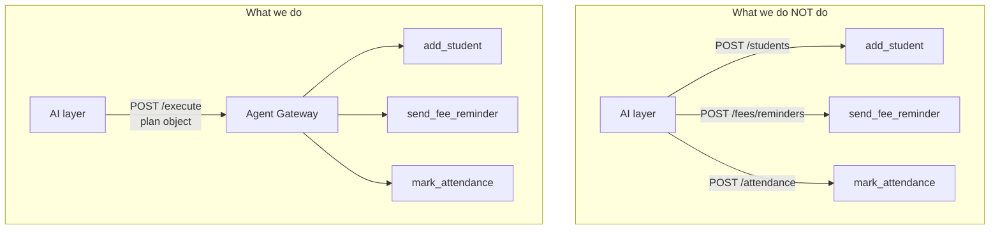

# Use Case

## The rule

The AI layer never calls a business API directly. It builds a **plan object** and posts it to a single fixed endpoint, `/execute`. The backend runs it.



Business endpoints stay internal. The AI layer does not know their URLs and could not reach them if it tried.

---

## What the plan carries

```json
{
  "plan_id": "pl_01J8X",
  "original_text": "ahmed ko class 5 blue mein add karo",
  "steps": [
    {
      "step": 1,
      "capability_id": "add_student",
      "capability_version": "a3f9c2e1",
      "parameters": {
        "name":    { "value": "Ahmed Raza" },
        "classId": { "value": 42, "label": "Class 5 Blue" }
      },
      "depends_on": []
    }
  ]
}
```

**One correction worth making:** the plan should carry the `capability_id`, **not** the API endpoint.

```
plan says:      capability_id = "add_student"
backend knows:  add_student → POST /api/students
```

The AI layer never learns the URL. That is the point.

---

## Worked example

**"ahmed ko class 5 blue mein add karo"**

```
AI layer
  → builds plan: add_student, name "Ahmed Raza", classId 42
  → POST /preflight   → "Add Ahmed Raza to Class 5 Blue?"  + token
  → user confirms
  → POST /execute     (plan + token)

Backend
  → token valid, version current
  → registry: add_student → POST /api/students
  → user may call add_student?            yes
  → Class 5 Blue within user's branch?    yes
  → preconditions pass?                   yes
  → audit row written
  → StudentService.add(...)
  → declared "creates one student record" — one created ✓
  → audit row completed

AI layer
  → "Added Ahmed Raza to Class 5 Blue."   (from template, not a model)
```

---

## In one line

**Capabilities are metadata the AI reads. They are not endpoints the AI calls.**