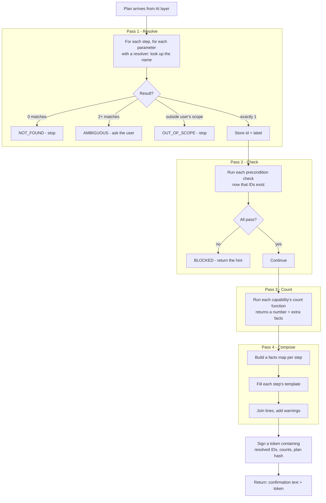
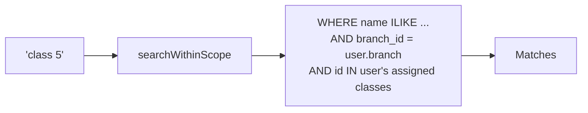
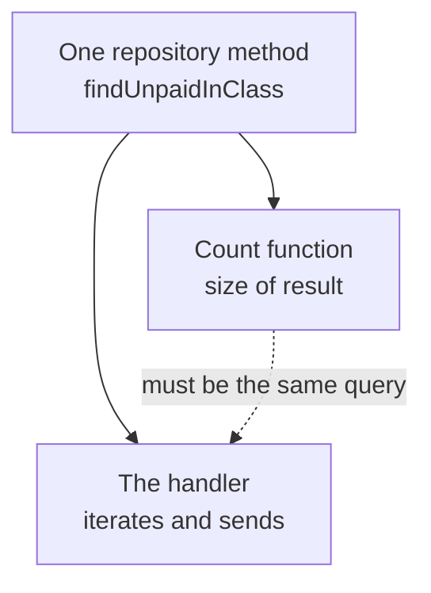
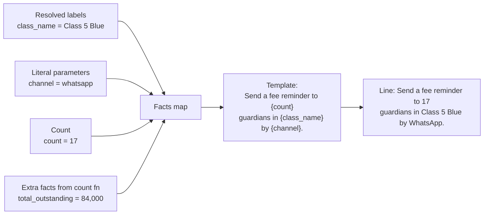

# Preflight — How Resolve, Count and Confirmation Actually Work

No AI anywhere in this document. Every step is deterministic code in the Spring Boot backend.

---

## 1. The whole pipeline



Four passes, in order, because each one needs the previous one's output. You cannot count students in a class before you know which class. You cannot write "17 guardians" before you have counted.

---

## 2. Resolve

### The interface

```java
public interface EntityResolver {
    List<Match> resolve(String raw, UserContext user);
}

public record Match(long id, String label, String context) { }
```

One implementation per resolver type. Seven or so for the whole system: `class`, `section`, `student`, `guardian`, `staff`, `fee_type`, `session`.

```java
@Component("class")
public class ClassResolver implements EntityResolver {
    public List<Match> resolve(String raw, UserContext user) {
        return classRepo.searchWithinScope(raw, user)   // scope is inside the query
            .stream()
            .map(c -> new Match(c.getId(), c.getName(), c.getBranchName()))
            .toList();
    }
}
```

### Scope lives in the query, not in a filter afterwards



This matters. If you search everything and filter afterwards, a teacher searching "class 5" gets zero results for a class that exists — and the difference between "no such class" and "not your class" leaks information. Put the scope in the `WHERE` clause and the resolver simply cannot see what it should not.

### Three outcomes

| Matches | Result |
| --- | --- |
| 0 | `NOT_FOUND` — "No class matching that" |
| 1 | Resolved. Store the ID **and the label** |
| 2+ | `AMBIGUOUS` — return candidates, AI layer asks |

Keep the label. `"Class 5 Blue"` goes into the confirmation text; `42` would be useless there.

---

## 3. Count

### The interface

```java
public interface AffectedCount {
    CountResult count(Map<String,Object> resolvedParams, UserContext user);
}

public record CountResult(long count, String unit, Map<String,Object> facts) { }
```

```java
@Component("send_fee_reminder.count")
public class SendFeeReminderCount implements AffectedCount {
    public CountResult count(Map<String,Object> p, UserContext user) {
        var students = feeRepo.findUnpaidInClass((Long) p.get("classId"), user);
        return new CountResult(
            students.size(),
            "guardians",
            Map.of("total_outstanding", sumOf(students))   // extra facts for the template
        );
    }
}
```

**Default to 1.** Most writes touch one record. If no count bean exists for a capability, the count is 1 and nobody writes any code.

### The rule that keeps counts honest



The count query and the real operation must use **the same repository method**. If the handler skips students whose guardian has no phone number and the count does not, you confirm 17 and send 14. Share the predicate, do not re-implement it.

Verification at execute is the backstop: the capability declared "one message log row per guardian," so compare the rows created against the confirmed count. A mismatch means the two drifted, and that is a bug worth paging someone over, not a warning to log.

---

## 4. Compose the confirmation

### Facts map per step



Plain string substitution. No model, no branching logic — if a placeholder has no fact, the build should have caught it (see section 7).

### One message from several steps

```
for each step:
    line = render(step.template, step.facts)

message  = numbered list of lines
         + irreversibility warning   (if any step has reverses = null)
         + approver note             (if any step is blast_radius = high)
```

Result:

```
1. Record PKR 5,000 against invoice 9912 for Ahmed Raza.
2. Email a fee receipt to the guardian.

Step 2 cannot be undone.
```

One dialog, one approval, whatever the step count. That is the point of doing this in preflight rather than per call.

---

## 5. Worked example

**"class 5 blue ke defaulters ko whatsapp par reminder bhejo"**

```
Plan in
  step 1: send_fee_reminder
          classId = { raw: "class 5 blue", resolver: "class" }
          channel = "whatsapp"

Pass 1 — Resolve
  ClassResolver("class 5 blue", user)
    → 1 match: id 42, label "Class 5 Blue"
  resolved: { classId: 42, class_name: "Class 5 Blue" }

Pass 2 — Check
  class_has_defaulters(42)          → pass
  messaging_balance_available()     → pass

Pass 3 — Count
  SendFeeReminderCount(42)
    → count 17, unit "guardians", facts { total_outstanding: 84000 }

Pass 4 — Compose
  facts = { count: 17, class_name: "Class 5 Blue",
            channel: "whatsapp", total_outstanding: 84000 }

  template: "Send a fee reminder to {count} guardians in
             {class_name} by {channel}."

  line:     "Send a fee reminder to 17 guardians in
             Class 5 Blue by WhatsApp."

  reverses = null  →  append "This cannot be undone."

Token
  sign({ plan_hash, classId: 42, count: 17, exp: +5min })

Out
  text:  "Send a fee reminder to 17 guardians in Class 5 Blue
          by WhatsApp. This cannot be undone."
  token: "pf_eyJ..."
```

---

## 6. The token

Make it a **signed blob, not a database row**. Preflight then stores nothing and stays stateless.

```
payload = { plan_hash, resolved_ids, counts, user_id, expires_at }
token   = base64(payload) + "." + hmac(payload, secret)
```

At execute the backend verifies the signature, checks expiry, and checks that the plan hash matches the plan it just received. A plan edited after confirmation fails immediately.

The AI layer treats this as opaque — stores it, sends it back, never opens it. That is the same shape as MCP's `requestState`, so if we ever move to MCP this part ports directly.

**Expiry: about 5 minutes.** After that, run preflight again rather than executing on stale counts.

**Delta rule at execute:** re-count inside the transaction. If the number has moved materially from what was confirmed — more than a few percent, or any change on a small count — fail rather than proceed. Someone approved 17, not 400.

---

## 7. Edge cases worth handling

### A step that depends on an earlier step

```
step 1: record_fee_payment   → produces receiptId
step 2: send_fee_receipt     → needs { from_step: 1, field: receiptId }
```

At preflight time that receipt does not exist, so step 2 cannot be resolved or counted.

**Fix: a second template.** Each capability declares a `pending_template` with no placeholders that depend on unknown values:

```yaml
confirmation_template: "Email receipt {receipt_no} to {guardian_name}."
pending_template:      "Email the receipt to the guardian."
```

Preflight uses `pending_template` for any step whose parameters are not yet knowable. Less specific, still honest.

### Cascades

Deactivating a student touches attendance rows, fee schedules, transport assignments. Counting all of it accurately is real work.

**Default:** count the primary entity and say so — "1 student, and their related records." Write the full count only for the few high blast radius capabilities where the number changes someone's decision.

### Build-time checks

Two, both cheap:

- **Every placeholder in a template must be producible.** It has to be a parameter name, a resolved label, `count`, or a declared fact key. Fail the build otherwise, or you ship a confirmation reading "Send a reminder to {count} guardians."
- **Every capability with `blast_radius` above `single` must declare a count bean.** Otherwise it silently confirms "1" while touching four hundred rows.

---

## 8. Summary

| Piece | Where it lives | AI involved |
| --- | --- | --- |
| Resolve names to IDs | `EntityResolver` bean per entity type | No |
| Scope enforcement | Inside the resolver's SQL | No |
| Preconditions | `PreconditionCheck` bean per check | No |
| Count | `AffectedCount` bean per capability, default 1 | No |
| Confirmation text | String substitution into a declared template | No |
| Token | Signed blob, verified at execute | No |

The AI layer's only job in all of this is to display the text it was given and send the token back.
